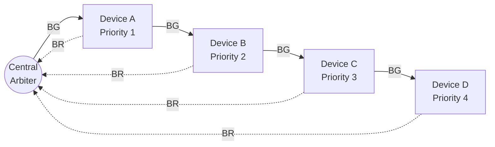
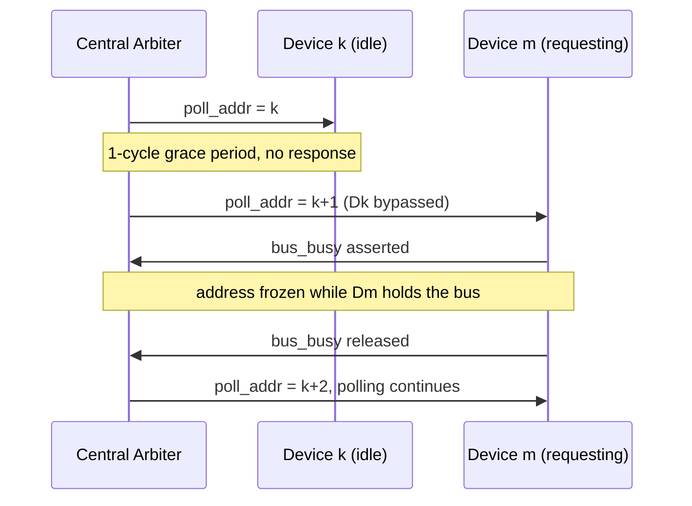
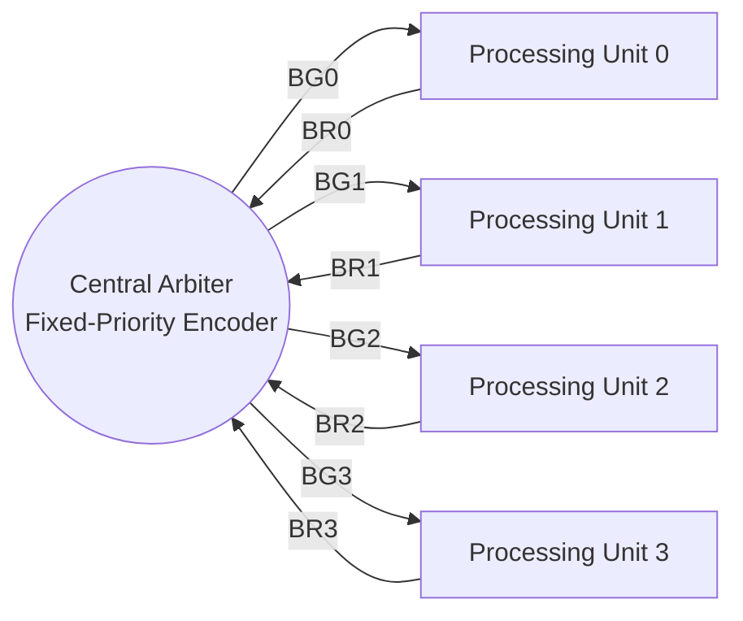

# Bus Arbitration Schemes

A shared bus can only be driven by one device at a time, so any system with multiple bus masters needs an **arbiter** — logic that decides, cycle by cycle, which requesting device is allowed to take control of the bus. This document covers three centralized arbitration architectures — **Daisy Chain**, **Polling (Rotating Priority)**, and **Independent Request** — along with the arbitration logic used in each.

All three designs are fully synchronous: bus ownership is always captured in a register on a clock edge, so grant signals never glitch even though the priority-resolution logic feeding them is combinational.

## 1. Daisy Chain Arbitration

Four devices (A–D) share a single, wired-OR **Bus Request (BR)** line and a single **Bus Busy (BB)** line. A single **Bus Grant (BG)** token originates at the central arbiter and is passed serially, device to device, down the chain. Priority is fixed by physical position: Device A sits closest to the arbiter and is highest priority; Device D is last in the chain and lowest priority.

**Arbitration logic**
- The arbiter issues the BG token whenever the shared BR line is asserted and the bus is free.
- At each device, the token is intercepted combinationally: a device blocks the token (`bg_out = bg_in & ~br_in`) if it has a pending request, otherwise it passes the token through unchanged. Since this logic is combinational, the token ripples through the entire chain within a single clock period rather than taking one clock cycle per hop.
- A device only latches ownership on a clock edge, and only if the token has reached it, it has an active request, and the bus is not already busy. Ownership is held non-preemptively until the device drops its own request, even if a higher-priority device asks for the bus afterward.
- BB is treated as a system-wide signal rather than something the arbiter derives internally — it lets an external condition (e.g. another bus master) hold off arbitration entirely.

**Single point of failure:** because the grant token has exactly one physical path through the chain, a dead or disconnected device blocks every device behind it. A practical mitigation is a bypass path at each node — a watchdog or heartbeat check that forces the token straight through (`bg_out = bg_in`) if a device fails to respond within a set window, effectively routing around the fault without redesigning the chain.

## 2. Polling (Rotating Priority) Arbitration

Up to eight devices share a **3-bit address bus** and a single **busy** line — there are no individual grant wires. The central arbiter broadcasts a rotating 3-bit address, and the device whose address matches claims the bus by asserting the shared busy line.

**Arbitration logic**
- Fairness: the instant a device releases the bus (a falling edge on the shared busy line), the arbiter immediately advances the address, so a device can never be re-polled ahead of its turn — round-robin order is strictly enforced.
- While an address is held, the polled device gets exactly one clock cycle to respond. If it doesn't — a broken or absent device — the arbiter times out and advances the address on its own, bypassing the faulty slot without stalling the rest of the system.
- A device asserts the busy line combinationally the instant its address is polled and it has a pending request, then latches ownership on the next clock edge and holds it non-preemptively until its own request drops.

## 3. Independent Request Arbitration

Four high-speed processing units each get a dedicated **BR/BG** pair — no shared line, no serial token. Priority resolution is a hardwired fixed-priority encoder, and the winning grant is resolved and registered within a single clock cycle.

**Arbitration logic**
- Priority is fixed: Unit 0 highest, Unit 3 lowest. The encoder grants a request only if every higher-priority request line is inactive (`comb_grant[1] = req[1] & ~req[0]`, and so on), so exactly one grant line can ever be active.
- Conflict resolution is entirely combinational and deterministic — with all four requesting simultaneously, Unit 0 wins within the same cycle, with no possibility of a metastable or ambiguous state.
- Bus ownership is non-preemptive: once a unit is granted the bus, the arbiter masks out every other request and re-evaluates only the current owner's line, so a higher-priority unit cannot interrupt mid-transaction. Full priority arbitration resumes only once the bus goes idle.

## Comparison

| Scheme | Priority Order | Wiring | Grant Latency | Fault Handling | Scalability |
|---|---|---|---|---|---|
| Daisy Chain | Fixed, by position | Shared BR/BB + serial BG chain | 1 clock cycle (combinational hop) | None inherent — a chain break blocks downstream devices | Poor — combinational path lengthens with each added device |
| Polling | Rotating (round-robin) | Shared address bus + busy line | Up to N cycles (1 per polled slot) | Built-in — unresponsive devices are timed out and skipped | Moderate — address width grows only as log₂(N) |
| Independent Request | Fixed, by encoder | Dedicated BR/BG pair per device | 1 clock cycle | None inherent — a broken device simply never requests | Poor — wiring and encoder grow linearly with device count |
